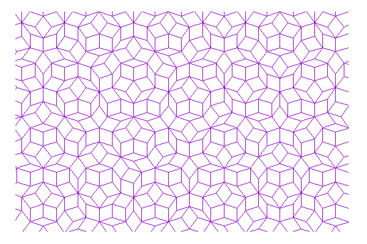
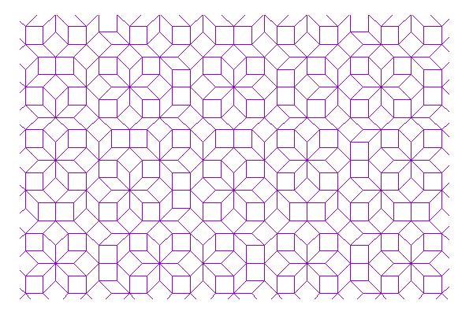
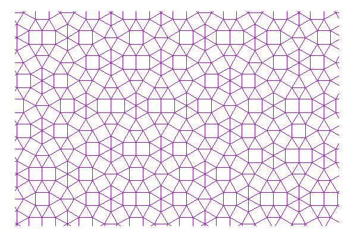
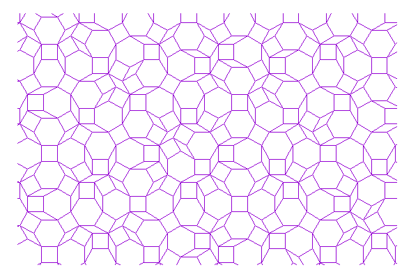
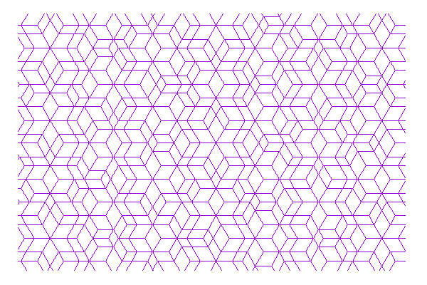

# Two-dimensional quasiperiodic tilings

Vertex points and connecting pairs are provided for some two-dimensional quasiperiodic tilings. 

- Penrose tiling (fat and skinny rhombuses)

- Ammann-Beenker tiling (squares and rhombuses)

- Stampfli tiling (triangles and squares)

- Socolar dodecagonal tiling (hexagons, squares, and rhombuses) [1]

- Eight-tile hexagonal golden-mean tiling (large and small hexagons, and parallelograms) [2]

## Binary files
Binary data files are located at a directory /binary. Each binary file includes the vertex points (~ one million) and nearest-neighbor bonds. The structure of the data should be clear after reading the source code of "src.cpp". Larger lattice data is upon request.

|Name| File | Sites | Bonds | *Density |
|:--|:-----------|:-----------:|:------------:|--:|
|Penrose tiling|Penrose.bin | 1 000 061 | 1 997 950    |1.23107|
|Ammann-Beenker tiling|AmmannBeenker.bin|1 000 017 | 1 997 824|1.20711|
|Stampfli tiling|Stampfli.bin|1 000 020|5 065 976             |1.07725|
|Socolar dodecagonal tiling [1]|Dodecagonal.bin|1 000 011| 1 815 192 |1.05157|
|Eight-tile hexagonal golden-mean tiling [2]|8TileGMT.bin|1 000 021 |1 997 760|1.58289|

*This is the exact value in the thermodynamic limit. (Longer) bond length is the unit.

## Simple application

`./GRAPH binary/[***.bin]`

"GRAPH" is generated by "make". When "GRAPH" is executed, "sites" and "bonds" files are generated. The subroutine "cut_data" in "src.cpp" can generate the vertices in the circular region with a certain radius R.

## Visualization
To visualize the tiling, "gnuplot" is convenient.

`plot "bonds" with lines`

"make fig" generates the png file for the tiling.

## References

[1] J. E. S. Socolar, Phys. Rev. B 39, 10519 (1989)

[2] S. Coates, R. Lifshitz, A. Koga, R. McGrath, H. R. Sharma, R. Tamura, arXiv:2201.11848
