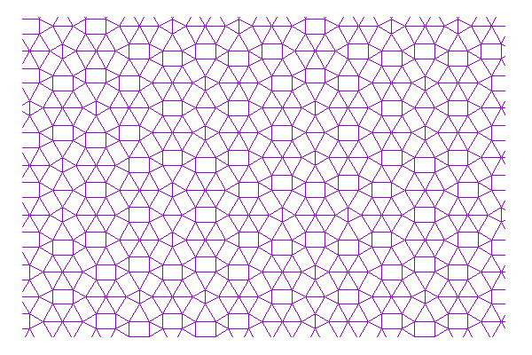

# Two-dimensional quasiperiodic tilings

Vertex points and connecting pairs are provided for some two-dimensional quasiperiodic tilings. 

- Penrose tiling (fat and skinny rhombuses)

- Ammann-Beenker tiling (squares and rhombuses)

- Stampfli tiling (triangles and squares) [1]

- Socolar dodecagonal tiling (hexagons, squares, and rhombuses) [2]

- Eight-tile hexagonal golden-mean tiling (large and small hexagons, and parallelograms) [3]

- Bronze-mean tiling (large and small triangles, and rectangles) [4]

## Binary files
Binary data files are located at a directory /binary. Each binary file includes the vertex points (~ten thousands) and nearest-neighbor bonds. The structure of the data should be clear after reading the source code of "src.cpp". 

Larger lattice data (~ one million) is located at
https://github.com/QPtiling/2Dtilings-Binary

|Name| File | Sites | Bonds | *Density |
|:--|:-----------|:-----------:|:------------:|--:|
|Penrose tiling|Penrose.bin | 10 006 | 19 805    |$2\cdot 5^{-3/4}\tau_1^{3/2}\sim$ 1.23107|
|Ammann-Beenker tiling|AmmannBeenker.bin| 10 009 | 19 808 |$\tau_2/2\sim$ 1.20711|
|Stampfli tiling|Stampfli.bin|10 008| 50 152             |$1/2+1/\sqrt{3}\sim$ 1.07735|
|Socolar dodecagonal tiling [1]|Dodecagonal.bin|10 008|17 985|$2(3+\sqrt{3})/9\sim$ 1.05157|
|Eight-tile hexagonal golden-mean tiling [2]|8TileGMT.bin|10 033| 19 848 |$2\tau_1^4/(5\sqrt{3})\sim$ 1.58289|
|Bronze-mean tiling|Bronze.bin|10 028|50 444||

*This is the exact value in the thermodynamic limit. (Longer) bond length is the unit.

** $\tau_1$ is golden-ratio and $\tau_2$ is the silver ratio.

## Simple application

`./GRAPH binary/[***.bin]`

"GRAPH" is generated by "make". When "GRAPH" is executed, "sites" and "bonds" files are generated. The subroutine "cut_data" in "src.cpp" can generate the vertices in the circular region with a certain radius R.

## Visualization
To visualize the tiling, "gnuplot" is convenient.

`plot "bonds" with lines`

"make fig" generates the png file for the tiling.

## References

[1] P. Stampfli, Helv. Phys. Acta 59, 1260 (1986)

[2] J. E. S. Socolar, Phys. Rev. B 39, 10519 (1989)

[3] S. Coates, R. Lifshitz, A. Koga, R. McGrath, H. R. Sharma, R. Tamura, arXiv:2201.11848

[4] T. Dotera, S. Bekku, and P. Ziherl, Nat. Mater. 16, 987 (2017).
